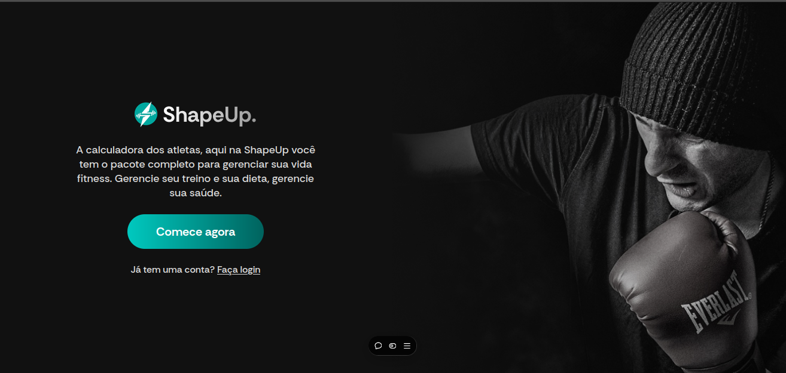
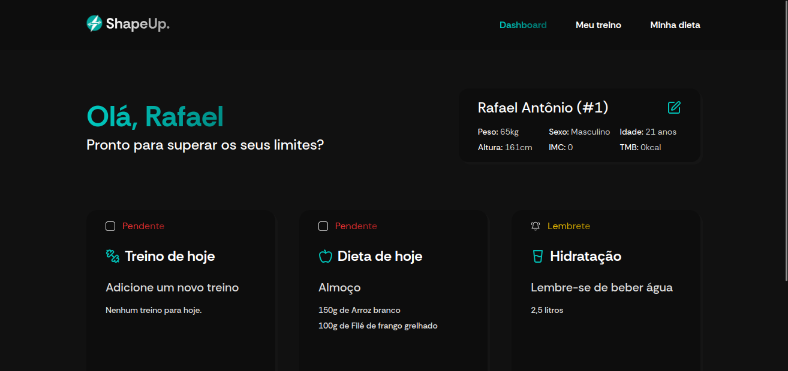
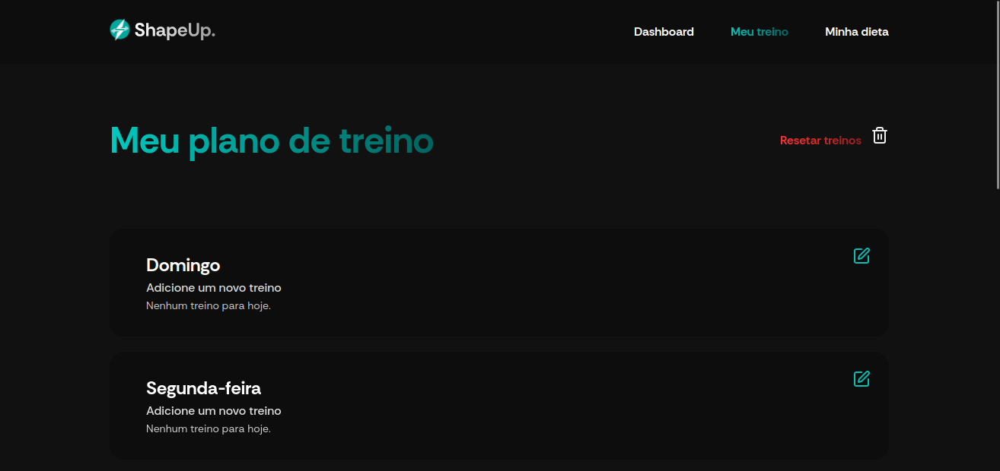
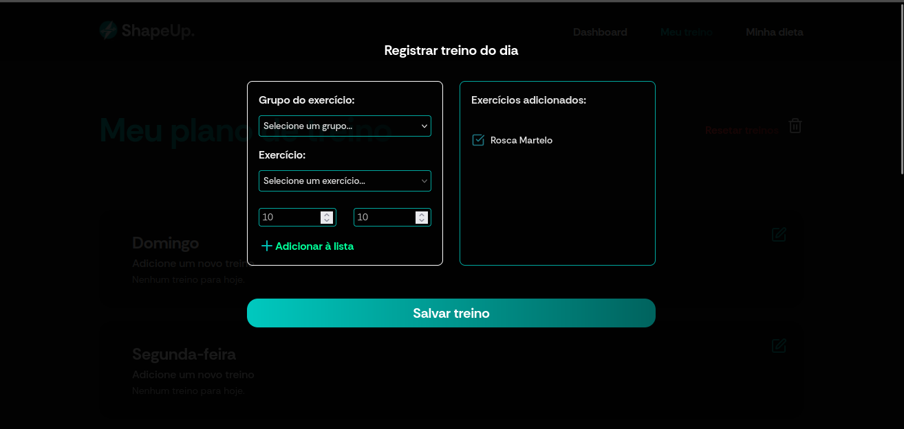
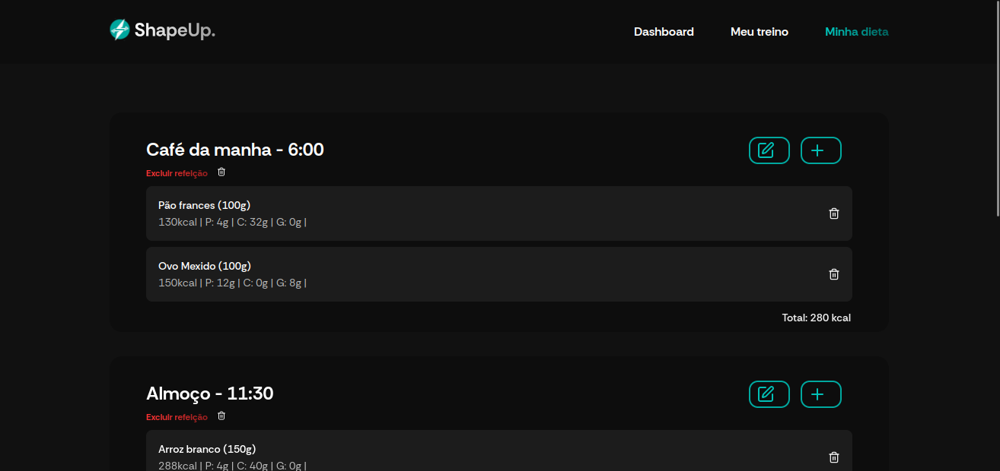
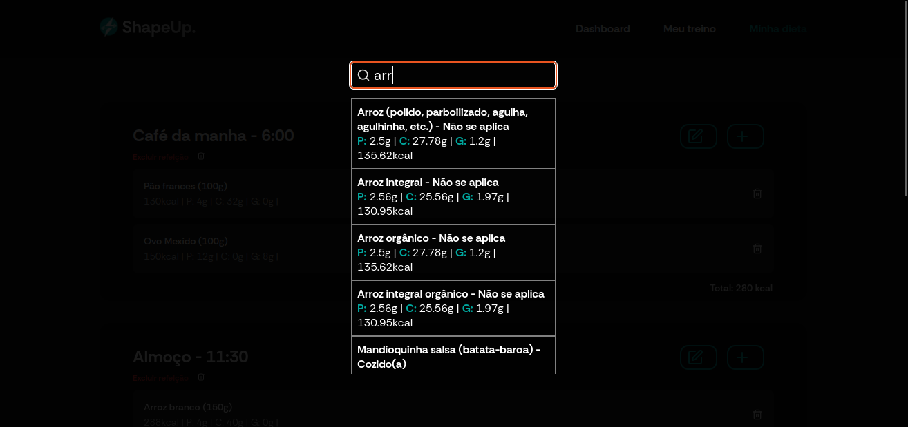
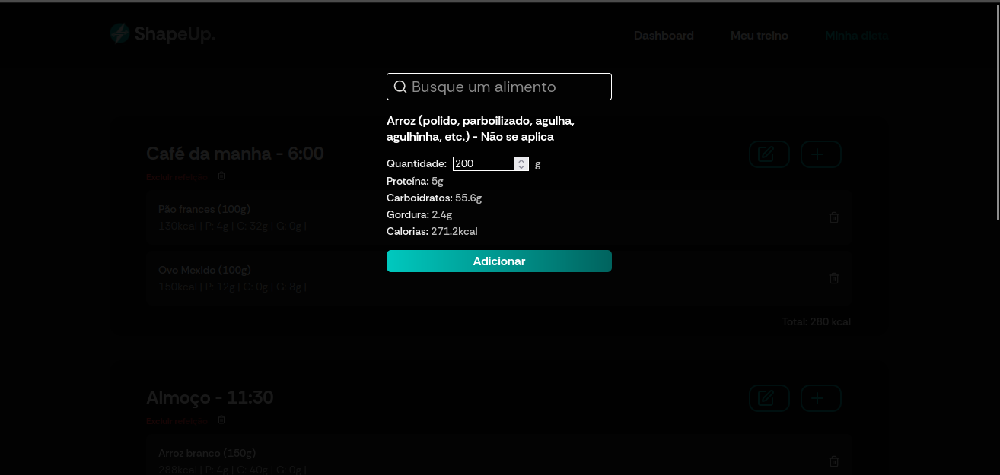

# ShapeUp (Front-end)

ShapeUp é uma ferramenta desenvolvida por mim, utilizando React. Com objetivo de ajudar atletas e pessoas dedicadas a uma vida saudável a gerenciar seus treinos, dietas e objetivos diários. Este projeto foi criado para demonstrar minhas habilidades em front-end e proporcionar uma experiência funcional e bem estruturada para o usuário.

---

## ✨ Funcionalidades

- **Dashboard**: Visualize seus objetivos diários, com dados claros e organizados.
- **Treinos Semanais**: Configure seus treinos com base em um banco de exercícios.
- **Planejamento Alimentar**: Planeje sua dieta diária, consultando a tabela TACO (Tabela Brasileira de Composição de Alimentos).

---

## 🚀 Tecnologias Utilizadas

- **React**: Biblioteca principal para construção da interface.
- **Redux Toolkit**: Gerenciamento de estado global.
- **Styled Components**: Estilização moderna e modular.
- **JSON Local**: Simulação de backend com um arquivo de dados no projeto.

---

## 🎯 Objetivo do Projeto

O ShapeUp foi criado como um portfólio para demonstrar:
- Conhecimentos em **React** e boas práticas de desenvolvimento.
- Capacidade de construir interfaces responsivas e dinâmicas.
- Habilidade de estruturar e gerenciar dados locais.
- Integração de estilização avançada com **styled-components**.

---

## 🖼️ Preview do Projeto

### Homepage

### Dashboard  

### Treinos

### Alimentação

---

## 📚 Referências

- **TACO (Tabela Brasileira de Composição de Alimentos)**: [Link oficial](http://www.tbca.net.br/)
- React: [Documentação](https://reactjs.org/)
- Redux Toolkit: [Documentação](https://redux-toolkit.js.org/)
- Styled Components: [Documentação](https://styled-components.com/)

---

## 📩 Contato

Gostou do projeto? Entre em contato comigo!  
📧 E-mail: [rafaeldamacena9304@gmail.com](rafaeldamacena9304@gmail.com)  
🌐 LinkedIn: [Rafael Damacena](https://www.linkedin.com/in/rafaeldamacena9304/)

---

## 🏆 Agradecimentos

A todos que incentivam e valorizam o desenvolvimento de ferramentas úteis para o bem-estar e qualidade de vida!

---

> Este projeto é parte do meu portfólio para fins educacionais e de demonstração.
